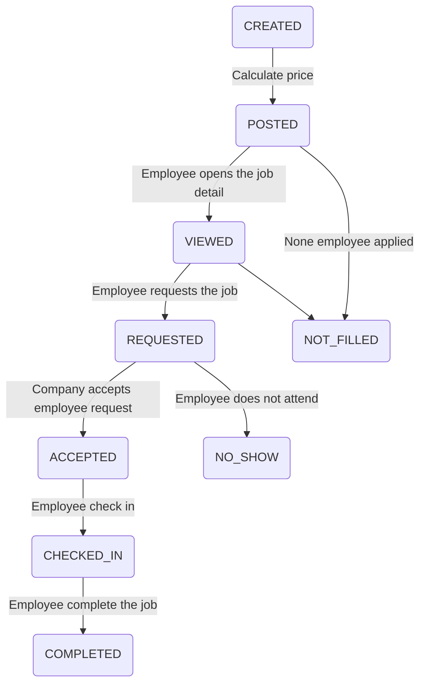

# Get a Shift

This is a platform to get one day job shifts.

# Domains
## Company
    Attributes: identity, name, address 
 - A company can be favorite by an Employee, this will affect get jobs list.

## Employee
    Attributes: identity, name, dob, address
 - An employee will be **frozen** by system, when **NO_SHOW** to some job, for 15 days. (Will be blocked to request new jobs)
 - Can request POSTED, VIEWED and REQUESTED jobs, following this order, and most nearby to start

## Job
    Attributes: title, description, start, end, price

>Job Status

 - When a job is created, employee cannot see it yet.
 - When job price is calculated, status is changed to POSTED, now employee can see it.
 - When job is requested, status is changed to REQUESTED, now company can accept job request
 - When company accepts job request, status is changed to ACCEPTED.
 - When is missing 1 hour to start a job, employee have 30 minutes to check in.
 - When more than 1 hour after job end time, company can check if job was done.
