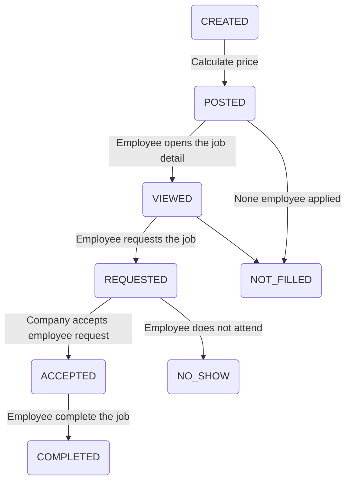

# Get a Shift

This is a platform to get one day job shifts.

# Domains
## Company
    Attributes: identity, name, address 
Actions:

    Create Company
# Get a Shift

This is a platform to get one day job shifts.

# Domains
## Company
    Attributes: identity, name, address 
Actions:

    Create Company

## Job
    Attributes: title, description, start, end, price
Actions: 

    Create Job

## Employee
    Attributes: identity, name, dob, address

>Job Status
 

## Billing 
## Payment
